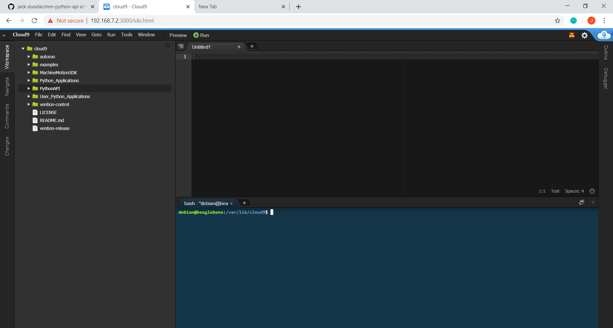

# Controlling MachineMotion with Python

<p style="text-align:center;" ></p>
<p style="text-align: center;"><span style="color: #808080; font-size: 11pt;"><em>Figure 1: MachineMotion Controller.</em></p>

<p>&nbsp;</p>

The MachineMotion Python API simplifies motion control and provides an intuitive, human-readable way to bring your equipment to life. 

Inexperienced programmers should consider using [MachineLogic's](https://www.vention.io/technical-documents/in-cad-automation-with-machinelogic-24) code-free visual sequence editor to create simple motion programs. 

However, for developing complex applications Python programs offer several attractives advantages. They are generally the optimal choice if:
* The application must communicate with custom hardware
* The application requires complex logic
* The application must integrate with third party software and tools

### For more information on 3D design using Vention, datasheets and more, please visit [Vention.io](https://www.vention.io/technical-documents/machinemotion-controller-datasheet-10)

<div>&nbsp;</div>

## Getting Started

To get started with the MachineMotion Python API:

* [Install Python on your computer](#install-python-on-your-computer)
* [Download the MachineMotion API](#install-python-on-your-computer)
* [Download the MachineMotion API](#install-python-on-your-computer)
* [Connect to MachineMotion](#install-python-on-your-computer)
* [Run your first program](#install-python-on-your-computer)

<div>&nbsp;</div>

### Install Python On Your Computer

The MachineMotion library supports both Python 2.7 and Python 3.6.

- If installing on Windows, make sure to add Python.exe to the PATH environment variable as shown in *Figure 2* and *Figure 3*.

<p style="text-align:center;" ></p>

<p style="text-align: center;"><span style="color: #808080; font-size: 11pt;"><em>Figure 2: Make sure to select "Add python.exe to path" if installing on Windows.</em></p>

<p style="text-align:center;" ></p>

<p style="text-align: center;"><span style="color: #808080; font-size: 11pt;"><em>Figure 3: Make sure to click "Add Python 3.6 to PATH" if installing on Windows.</em></p>

<div>&nbsp;</div>


### Download The API Library

The MachineMotion controller software comes pre-installed on the MachineMotion controller. There are two versions of the Python API, so the correct version of the Python API must be selected. The table below shows which version should be downloaded.

| Controller Software| Python API | Git Clone | Link |
| ------------- |:-------------:| :-----:| ---|
| v1.2.11 and earlier    | Python API v1.6.8 | `git clone https://github.com/VentionCo/mm-python-api/tree/release/v1.6.8` | [v1.6.8](https://github.com/VentionCo/mm-python-api/tree/release/v1.6.8) |
| v1.12.0 and later    | Python API v2.0+     | `git clone https://github.com/VentionCo/mm-python-api/tree/release/v2.0`) | [v1.12.0](https://github.com/VentionCo/mm-python-api/tree/release/v2.0)

<p style="text-align: center;"><span style="color: #808080; font-size: 11pt;"><em>If your MachineMotion controller is connected to your computer (192.168.7.2), you can check its software version <a href="">here</a></em></p>

<b>To Download the API library</b>:
<hr>

<div style="text-align: center">
Open the command prompt (for Windows) or the terminal (for Mac or Linux), navigate to your destination folder and paste the suitable 'git clone' command  

<span style="color: #808080; font-size: 11pt;"> or </span>

Follow the download link above and unzip the contents in your directory of choice
</div>
<hr>

### Need Help? See Github's download guide [here](https://help.github.com/en/github/creating-cloning-and-archiving-repositories/cloning-a-repository)

<div>&nbsp;</div>

### Download the required libraries

 Open the command prompt (for Windows) or the terminal (for Mac or Linux) and run the following installations  

  ```console
  pip install -U socketIO-client
  ```  
  
  ```console
  pip install -U pathlib
  ```

  ```console
  pip install -U paho-mqtt
  ```

The MachineMotion Python library is now installed and ready to use! Continue below to start your first custom program. 

<div>&nbsp;</div>

## Connecting to MachineMotion

MachineMotion connects to a laptop through Ethernet. If your laptop does not have an ethernet port, use the USB to ethernet converter included with the MachineMotion. 

If you require more information about how to setup you controller to communicate with your computer or network, consult the resource below.

[QuickStart: Connecting to MachineMotion](__documentation/quick_start/machine_motion--quickstart.md)

<div>&nbsp;</div>

## Loading programs onto MachineMotion
There are 2 ways to load a custom python script onto MachineMotion, with the command line or with the cloud9 IDE.

### Using Command Line

<p style="text-align:center;" ></p>

   - Open the command prompt (for windows) or terminal (for Mac and Linux)
   - Browse to the directory where the MachineMotion API library is saved
   - Execute the demo program with the following line of code:
      - `python examples/example--demo.py`
   - The demo program will launch. Press q or Cntrl+C to quit at anytime. 

### Using Cloud9 IDE

- Open up the Cloud9 IDE: [http://192.168.7.2:3000/ide.html](http://192.168.7.2:3000/ide.html)
<p style="text-align:center;" ></p>

- Copy and paste the `mm-python-api` folder into the cloud9 IDE
<p style="text-align:center;" ></p>

- Navigate to `examples/example--demo.py`
<p style="text-align:center;" ></p>

- Press "Run" in the top of the cloud9 IDE
<p style="text-align:center;" ></p>


## Explore the Docs!

Congratulations on loading your Python API script!

Continue your journey by reading the docs and reading the example codes.
[Application Programming Interface: Python v1.6.8](__documentation/api/machine_motion_python_api--v1.6.8.md)

## Release Notes
[Release Notes: Python v1.6.8](release-notes.md)

###### Please send any technical documnetation feedback to info@vention.cc with the subject "Technical Documentation"