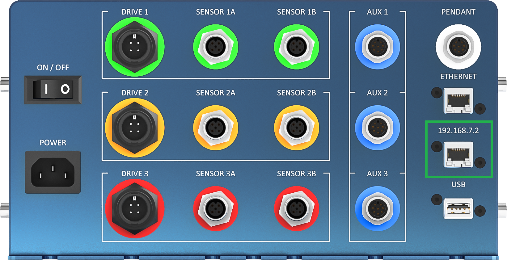
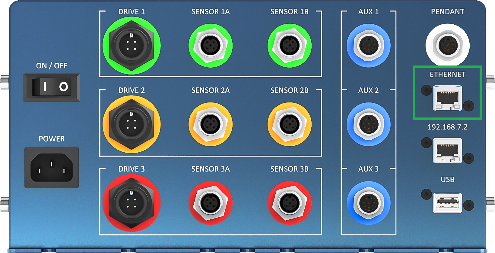
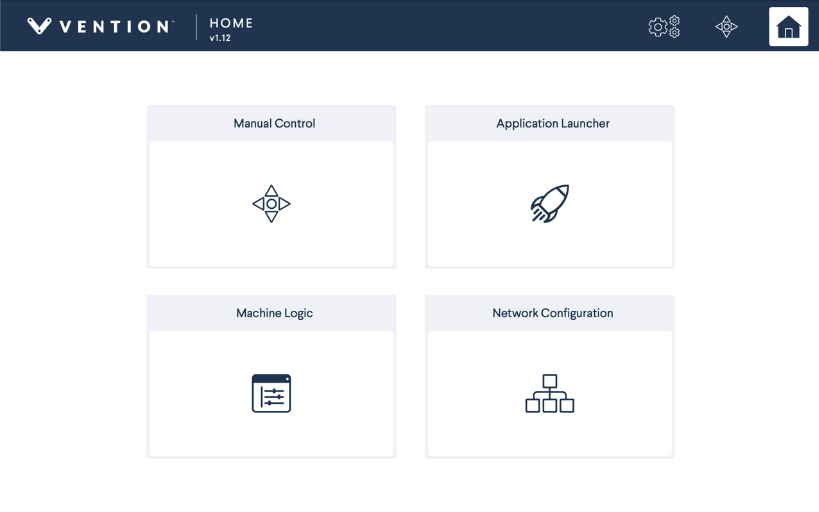
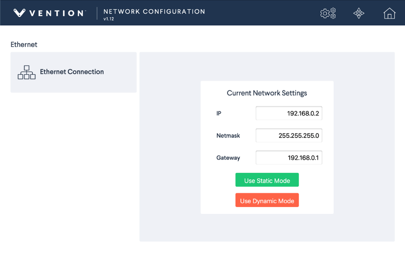

## Connecting to MachineMotion

MachineMotion offers several connection options to interact with external devices. More precisely, three communication methods are available.

- The 192.168.7.2 port (fomerly labelled DEFAULT ETHERNET)
- The ETHERNET port
- The PENDANT port

### Using the 192.168.7.2 port (Formerly labelled DEFAULT ETHERNET)
This method is mostly used to connect a computer to MachineMotion in a peer-to-peer way (one to one connection). It is also useful to have access to the system in case other ports are not available for use.
Connecting
Simply connect an Ethernet cable in the port that is labelled 192.168.7.2 (formerly labelled DEFAULT ETHERNET). If you do not have an Ethernet port on your computer, utilize the Ethernet to USB adapter provided with the controller.

<em>Figure 4: The 192.168.7.2 pre-configured Ethernet port on the MachineMotion controller, in the green box.</em>

By default, the network adapter of your computer should be in DHCP mode and configure itself automatically.

#### Optional Details
The MachineMotion controller acts as a DHCP server on this port. When another device is connected, it assigns it the 192.168.7.1 address and auto assigns itself to 192.168.7.2. For this to properly function, your computer adapter settings must be set to DHCP (which is the default).

### Using the ETHERNET port
Using the ETHERNET port is useful when connectiong MachineMotion to a standard, multi-device Ethernet network. This use case becomes necessary when connecting multiple MachineMotion controllers together in multi-controller systems and when connecting MachineMotion on a LAN or WLAN.

<em>Figure 5: The 192.168.7.2 pre-configured Ethernet port on the MachineMotion controller, in the green box.</em>

#### Connecting using DHCP
A DHCP client natively runs on the controller and will respond to DHCP commands from a DHCP server. Follow the steps below to configure your controller in DHCP mode.

- Step 1: Connect a computer to the 192.168.7.2 port (formerly DEFAULT ETHERNET) and browse to 192.168.7.2 using Google Chrome.

<em>Figure 6: MachineMotion ControlCenter Main Page</em>

 
- Step 2: Click on the Network Configuration tab.

<em>Figure 6: MachineMotion ControlCenter Main Page</em>

 
- Step 3: Click on “Use Dynamic Mode”

At this point, you will see the currently active IP address that the ETHERNET port was assigned in the ControlCenter fileds. You can ask your network administrator to assign rules to address your controller using its MAC address. To do the later, you will need to get the MAC address of the controller. Consult *Appendix B*.

#### Connecting using Static Mode
If the application requires the use of fixed IP addresses on your network, you can utilize a similar method to configure the MachineMotion controller.
In order to do so, some parameters of the Network need to be known. Usually, this is available from your system administrator or from the configuration utility of your network router.

- Step 1: Connect a computer to the 192.168.7.2 port (formerly DEFAULT ETHERNET) and browse to 192.168.7.2 using Google Chrome.

<em>Figure 8: MachineMotion ControlCenter Main Page</em>

 
- Step 2: Click on the Network Configuration tab.

<em>Figure 9: MachineMotion ControlCenter Main Page</em>

 
Step 3: Enter the IP, Netmask & Gateway fields and click on “Use Static Mode”.

#### Using the PENDANT
The MachineMotion pendant allows users to have a configuration free connection to the controller. Simply connect the pendant in the PENDANT port using its 8 pin M12 cable.

---
